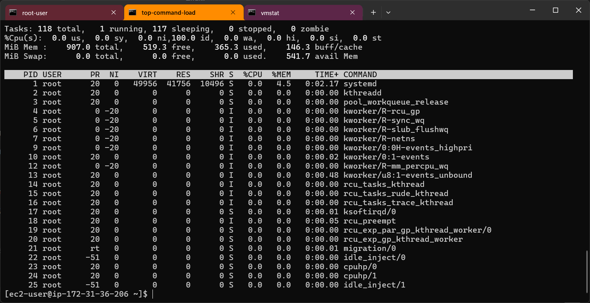
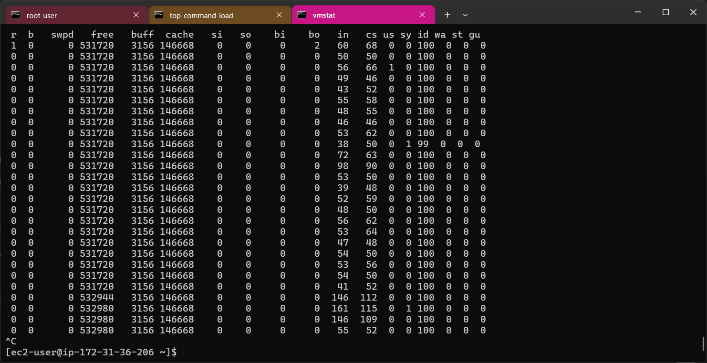
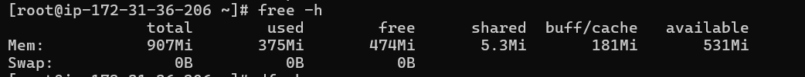
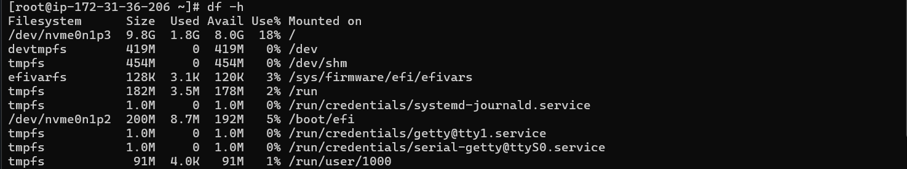
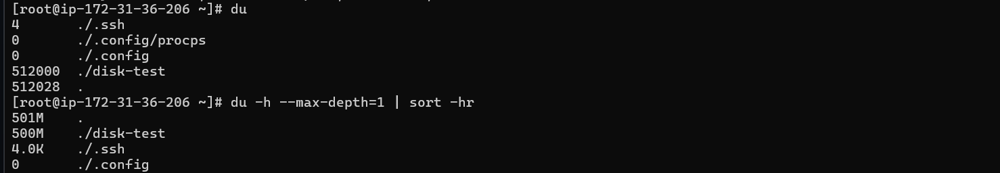
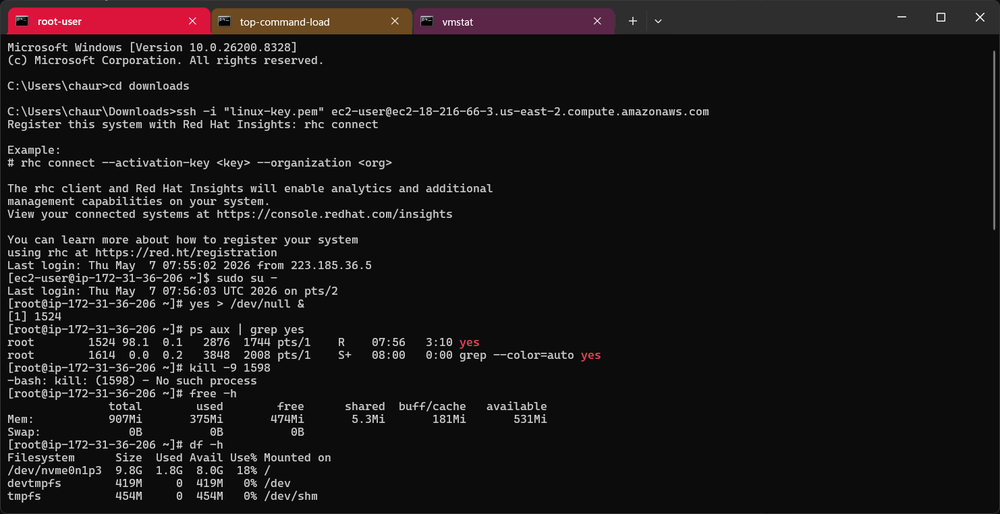

# 🚀 Linux Monitoring & Troubleshooting Lab

A hands-on DevOps project focused on Linux system monitoring, process management, performance analysis, and troubleshooting using real-world Linux commands on AWS EC2.

---

# 📌 Project Overview

This project demonstrates how DevOps engineers monitor and troubleshoot Linux servers using essential command-line utilities.

The lab simulates:
- High CPU usage
- Process investigation
- Memory monitoring
- Disk usage analysis
- Process priority management
- System troubleshooting workflow

---

# 🛠 Technologies & Tools

| Tool | Purpose |
|---|---|
| AWS EC2 | Cloud server environment |
| Linux (RHEL/Amazon Linux) | Operating System |
| Git & GitHub | Version control |
| VS Code | Code editor |
| Git Bash | Terminal & Git operations |

---

# 📂 Project Structure

```text
linux-monitoring-troubleshooting-lab/
│
├── README.md
├── screenshots/
├── commands/
└── notes/
```

---

# 🎯 Learning Objectives

This project helps understand:

- Linux resource monitoring
- CPU troubleshooting
- Memory troubleshooting
- Disk usage investigation
- Process management
- Nice values & priorities
- Real-time Linux troubleshooting workflow
- DevOps operational debugging

---

# ⚙️ Linux Commands Covered

| Command | Description |
|---|---|
| `top` | Real-time system monitoring |
| `htop` | Interactive process viewer |
| `ps` | Display running processes |
| `vmstat` | System performance statistics |
| `free` | Check memory usage |
| `df` | Filesystem disk usage |
| `du` | Directory disk usage |
| `nice` | Start process with priority |
| `renice` | Change process priority |
| `kill` | Terminate process using PID |
| `pkill` | Kill process by name |

---

# 🧪 Hands-On Lab Workflow

## 1️⃣ Connect to AWS EC2

```bash
ssh -i "linux-key.pem" ec2-user@18.216.66.3
```

---

## 2️⃣ Switch to Root User

```bash
sudo su -
```

---

## 3️⃣ Generate CPU Load

```bash
yes > /dev/null &
```

This command creates artificial CPU load for troubleshooting practice.

---

## 4️⃣ Monitor Running Processes

```bash
top
```

### Useful `top` Shortcuts

| Shortcut | Action |
|---|---|
| `Shift + P` | Sort by CPU usage |
| `Shift + M` | Sort by memory usage |
| `k` | Kill process |
| `r` | Change nice value |
| `q` | Exit top |

---

## 5️⃣ Find Specific Process

```bash
ps aux | grep yes
```

---

## 6️⃣ Change Process Priority

```bash
renice -n 10 -p <PID>
```

### Nice Value Priority Range

| Nice Value | Priority |
|---|---|
| `-20` | Highest Priority |
| `0` | Default Priority |
| `19` | Lowest Priority |

---

## 7️⃣ Monitor System Performance

```bash
vmstat 1
```

### Important vmstat Fields

| Field | Meaning |
|---|---|
| `r` | Running processes |
| `free` | Free memory |
| `si` | Swap in |
| `so` | Swap out |
| `wa` | I/O wait |
| `id` | CPU idle |

---

## 8️⃣ Check Memory Usage

```bash
free -h
```

---

## 9️⃣ Check Disk Usage

```bash
df -h
```

---

## 🔟 Create Disk Usage for Testing

```bash
mkdir disk-test
```

```bash
dd if=/dev/zero of=disk-test/file1.img bs=100M count=5
```

This creates a 500MB file for disk troubleshooting practice.

---

## 1️⃣1️⃣ Find Large Files & Directories

```bash
du -h --max-depth=1 | sort -hr
```

---

## 1️⃣2️⃣ Kill High CPU Process

```bash
pkill yes
```

OR

```bash
kill -9 <PID>
```

---

# 📊 DevOps Troubleshooting Workflow

```text
Server Performance Issue
          ↓
Check CPU Usage → top / htop
          ↓
Find Problematic Process → ps
          ↓
Analyze Memory → free / vmstat
          ↓
Check Disk Space → df
          ↓
Find Large Files → du
          ↓
Optimize / Kill Process
```

---

# 📸 Screenshots

Store screenshots inside:

### Top Monitoring



---

### VMStat Output



---

### Free Memory Output



---

### DF Output



---

### DU Analysis



---

### Process Troubleshooting



---

# 🔥 Key Learnings

- Linux server monitoring
- Resource utilization analysis
- Process troubleshooting
- CPU bottleneck investigation
- Memory analysis
- Disk space troubleshooting
- Real-world DevOps debugging techniques

---

# 🚀 Future Enhancements

- Shell scripting automation
- Log monitoring
- Docker monitoring
- Kubernetes monitoring
- CI/CD integration
- Prometheus & Grafana setup

---

# 👩‍💻 Author

## Jaishree Chaure

DevOps & Cloud Learning Journey 🚀

---

# ⭐ GitHub Repository Purpose

This repository is part of my DevOps hands-on learning journey and demonstrates practical Linux troubleshooting and monitoring skills commonly used by DevOps Engineers and Cloud Engineers.